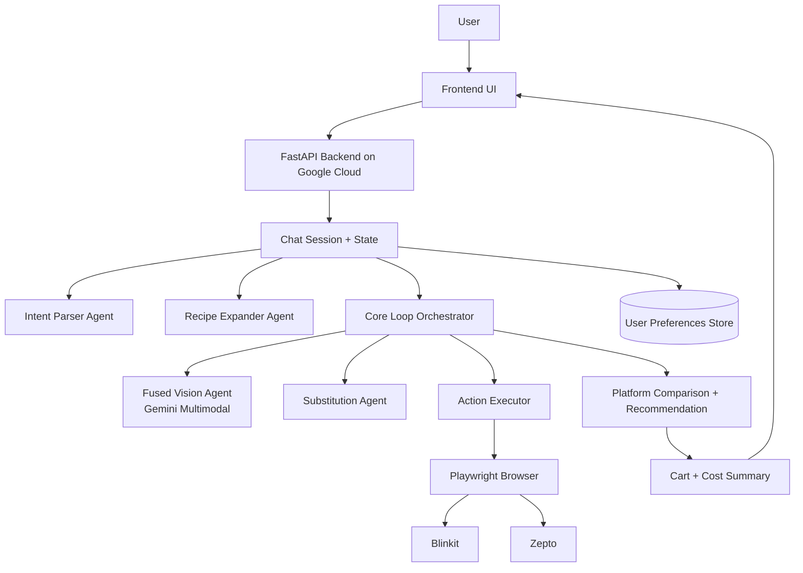

# CookWithMe

CookWithMe is a Gemini-powered, multimodal, multi-agent grocery assistant for Indian quick-commerce.
It understands user intent in plain language, sees what is on screen, and executes shopping actions end-to-end.

Supported platforms:
- Blinkit
- Zepto

## Problem We Solve

Online grocery buying is still high-friction, especially for busy users and families:
- Recipe ideas are disconnected from actual cart building.
- Users manually search each ingredient and decide among many pack sizes and variants.
- Price and availability vary by platform, so users repeat the same work across apps.
- Building a complete cart takes time, attention, and frequent corrections.

This causes three real costs:
- Time cost: repetitive effort for every meal plan.
- Money cost: missing better platform choices and offers.
- Cognitive cost: constant micro-decisions (quantity, substitutes, brands, budget).

CookWithMe converts this into one guided flow: ask once, review once, and let the agent complete the rest.

## What CookWithMe Does

Example prompts:
- Make paneer butter masala for 4
- Buy 2L milk, 500g paneer, and eggs

CookWithMe then:
1. Parses user intent and extracts structured requirements.
2. Expands recipe requests into a practical shopping list.
3. Uses Gemini multimodal reasoning on screenshots to decide the next executable actions.
4. Adds items, handles unavailable products with meaningful substitutes, and tracks progress live.
5. Compares outcomes across platforms and recommends where to buy for better value.
6. Returns a clear cart and cost summary.

## How It Helps Users

- Saves effort: recipe-to-cart in one conversation.
- Saves time: no repeated manual searching for each item.
- Saves money: platform comparison helps users choose better total value.
- Improves confidence: live progress + transparent summary before checkout.
- Works around uncertainty: substitution and quantity handling keep flows moving.

## Core Features

- Multimodal agentic shopping using Gemini screenshot understanding.
- Personalized experience with one-time preference setup and reuse.
- Multi-agent orchestration with specialized agents per responsibility.
- Recipe expansion to structured shopping items with quantities.
- Substitution planning for unavailable products.
- Cross-platform execution and comparison (Blinkit + Zepto). Help users in decision making.
- Session continuity for smoother repeat usage.
- Real-time frontend updates through SSE/WebSocket.

## Personalization (Set Once, Reuse Later)

CookWithMe stores user preferences after initial setup and applies them in future sessions:
- Dietary style and restrictions.
- Budget level.
- Preferred platform.
- Preferred brands.
- Pack-size behavior and household defaults.

Result: users do not need to restate the same context each time.

## Multi-Agent Platform Overview

CookWithMe is built as a coordinated agent platform, not a single prompt chain.

Main agents:
- Intent Parser Agent: converts open-ended user text to structured shopping intent.
- Recipe Expander Agent: turns recipe goals into complete grocery items.
- Fused Vision Agent: reads screenshots, reasons about UI state, and proposes precise next actions.
- Substitution Agent: finds practical, recipe-compatible alternatives.
- Core Loop Orchestrator: executes and verifies actions, tracks step status, and manages progress.

This separation improves reliability, debuggability, and extensibility for production use.

## Architecture Diagram

## Tech Stack

- Python 3.12
- FastAPI backend
- Gemini API via google-genai (multimodal reasoning)
- Playwright (Chromium)
- Pydantic v2 models
- HTML/CSS/JS frontend served by backend
- Docker for containerised deployemnt
- Google Cloud Run deployment flow

## Repository Structure

- gemini/server.py: API layer, chat/events endpoints, UI serving.
- gemini/agents/: multimodal and text agents.
- gemini/core/: orchestration loop, browser manager, session logic, models.
- gemini/frontend/: web UI assets.
- utils/: helper scripts for sessions and profile handling.
- scripts/: container startup scripts (including noVNC runtime).

Runtime-created directories:
- sessions/: local session artifacts.
- screenshots/: runtime captures for debugging and evaluation.

## Spin-Up Instructions (Reproducible)

1. Create and activate virtual environment.

	python -m venv venv
	source venv/bin/activate

2. Install dependencies.

	pip install -r requirements.txt
	playwright install chromium

3. Configure environment.

	cp .env.example .env
	#### Set GOOGLE_API_KEY in .env

4. Run backend.

	venv/bin/python -m gemini.server --port 8000

5. Open app.

	http://localhost:8000

## Local Docker Deployment Testing

Use this flow to test the full app in a local container, including visible browser UI via noVNC.

1. Build image.

	docker build -f Dockerfile.novnc -t cook-with-me-novnc:local .

2. Create runtime env file (do not commit this file).

	nano runtime.env

Add:

	GOOGLE_API_KEY=YOUR_KEY
	DEMO_TOKEN=

3. Run container.

	docker run -d --restart unless-stopped \
	  --name cook-with-me-novnc \
	  --env-file runtime.env \
	  -p 8080:8080 \
	  -p 6080:6080 \
	  -e BROWSER_HEADLESS=false \
	  cook-with-me-novnc:local

4. Verify container health.

	docker ps
	docker logs --tail 120 cook-with-me-novnc

5. Open URLs.

	http://localhost:8080
	http://localhost:6080/vnc.html

## Manual Login and Session Save Flow (UI)

Users must authenticate themselves in the real browser UI.

1. Open the app UI.
2. Click Accounts.
3. Choose Blinkit or Zepto.
4. In noVNC browser, complete login manually.
5. Select delivery location/address manually inside platform UI.
6. Return to app chat and type done.
7. The app stores the session and uses it for subsequent automation.

Recommended run order for first-time setup:

1. Open noVNC tab first.
2. Open app tab second.
3. Connect platform and login.
4. Type done in app chat after login and location selection completes.
5. Start shopping prompts.

## Google Cloud Deployment

This project includes a ready Cloud Run deployment script:
- [deploy.sh](deploy.sh)

Deploy steps:
1. Authenticate and set project.

	gcloud auth login
	gcloud config set project YOUR_PROJECT_ID

2. Export Gemini key.

	export GOOGLE_API_KEY="YOUR_KEY"

3. Deploy.

	bash deploy.sh

The script builds the container with Cloud Build and deploys to Cloud Run.

## Platform Comparison Value

CookWithMe helps users decide where to buy, not just what to buy.

It compares platform outcomes to recommend the better option based on:
- Item coverage.
- Effective total value.
- Delivery and fee impact.
- Substitution burden.

This directly improves user outcomes on time and money.

## What I'm Are Proud Of

- A real multimodal agent that acts on screen context in real time.
- A true multi-agent platform with clear role boundaries.
- Personalization that users configure once and reuse.
- Cross-platform recommendation focus for practical cost/time savings.
- End-to-end flow from intent to completed cart with transparent status.

## Learnings and Findings

- Multimodal action planning significantly improves robustness in dynamic UI flows.
- Specialized agents outperform monolithic prompts for complex workflows.
- Preference memory materially improves user experience in repeated sessions.
- Platform-to-platform differences make comparison logic highly valuable to users.

## Future Roadmap

- Stronger recommendation scoring using richer price and delivery signals.
- Expanded platform coverage.
- Optional voice-first interactions.

## License

MIT
